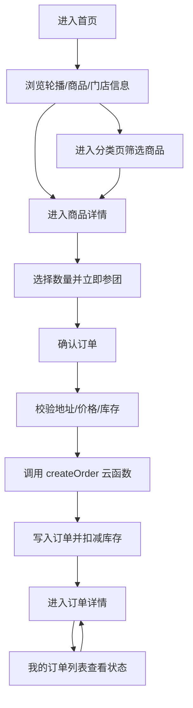
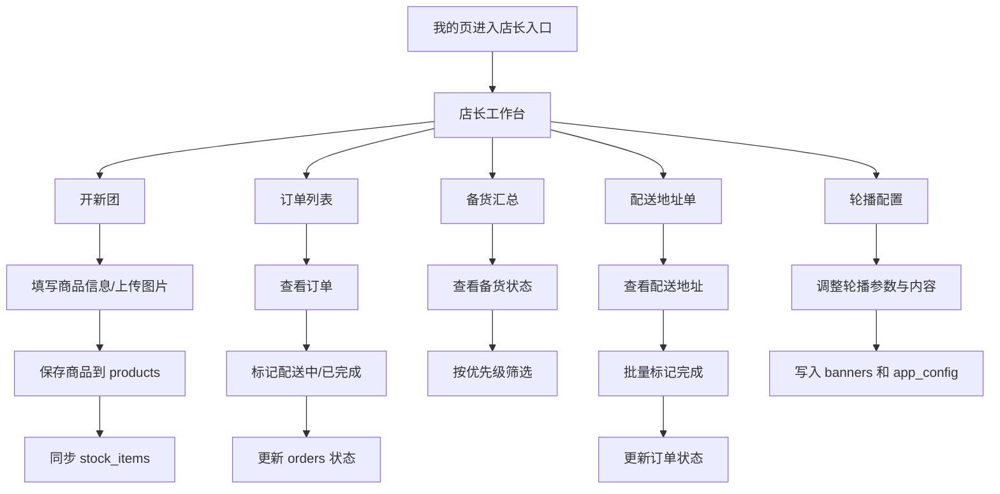

# 初炉小程序项目完整性排查报告

## 1. 排查目标

本报告基于当前仓库中的用户端、管理端、云函数、数据库设计与现有文档，对项目进行全流程梳理与完整性排查，输出：

- 用户端到管理端的完整业务链路图
- 已实现模块与业务节点对照结果
- 缺失功能与缺失页面清单
- 缺失项优先级、影响程度、业务价值与建议周期

## 2. 项目边界

当前项目定位为：

- 用户端：浏览商品、查看详情、提交订单、查看订单、查看门店信息
- 管理端：查看工作台、开新团、配置轮播、查看订单、查看备货、查看配送地址
- 后端能力：微信小程序云开发、云数据库、云函数

当前代码已具备可运行骨架，核心交易主链路已初步打通，但仍处于“演示可用 + 部分真实业务接入”的阶段，离完整商用版本还有明显差距。

## 3. 全流程链路图

### 3.1 用户端主链路

### 3.2 管理端主链路

### 3.3 异常链路

## 4. 已实现业务节点梳理

### 4.1 用户端

已实现：

- 首页轮播、商品展示、购买动态、门店信息展示
- 分类页商品筛选
- 商品详情展示
- 确认订单页价格计算、地址读取、下单调用
- 创建订单云函数事务扣库存
- 我的订单列表
- 订单详情页状态、商品、地址、进度展示
- 我的页店铺信息与店长入口

已接真实云端或云端衍生数据：

- 商品
- 分类
- 订单
- 地址
- 轮播
- 购买动态
- 门店配置

### 4.2 管理端

已实现：

- 店长权限校验
- 店长工作台统计卡片与快捷入口
- 开新团表单、上传图片、保存商品
- 轮播配置保存
- 订单列表查看与状态流转
- 备货汇总展示
- 配送地址单查看、导出、批量完成

已接真实云端或云端衍生数据：

- 订单列表
- 工作台统计
- 备货数据
- 配送地址单
- 商品创建
- 轮播配置
- 门店配置

## 5. 页面覆盖核对

### 5.1 当前已存在页面

| 端 | 页面 | 路由 | 当前状态 |
| --- | --- | --- | --- |
| 用户端 | 首页 | `pages/home/index` | 已实现 |
| 用户端 | 分类页 | `pages/category/index` | 已实现 |
| 用户端 | 商品详情 | `pages/product/detail` | 已实现 |
| 用户端 | 确认订单 | `pages/order/confirm/index` | 已实现 |
| 用户端 | 订单列表 | `pages/order/list/index` | 已实现 |
| 用户端 | 订单详情 | `pages/order/detail/index` | 已实现 |
| 用户端 | 我的 | `pages/mine/index` | 已实现 |
| 管理端 | 工作台 | `pages/admin/dashboard/index` | 已实现 |
| 管理端 | 开新团 | `pages/admin/create-group/index` | 已实现 |
| 管理端 | 轮播配置 | `pages/admin/banner-config/index` | 已实现 |
| 管理端 | 订单列表 | `pages/admin/order-list/index` | 已实现 |
| 管理端 | 备货汇总 | `pages/admin/stock-summary/index` | 已实现 |
| 管理端 | 配送地址单 | `pages/admin/delivery-address/index` | 已实现 |

### 5.2 明显缺失页面

| 端 | 缺失页面 | 作用 |
| --- | --- | --- |
| 用户端 | 收货地址列表/编辑页 | 用户管理地址、切换默认地址 |
| 用户端 | 支付结果页 | 下单成功后的明确反馈与跳转承接 |
| 用户端 | 售后/退款说明页 | 订单异常、取消、售后承接 |
| 用户端 | 门店详情/关于页 | 展示营业信息、配送说明、品牌介绍 |
| 管理端 | 门店配置中心 | 维护店名、配送范围、客服时间、公告、售后说明 |
| 管理端 | 商品管理列表页 | 统一上下架、编辑商品、查看库存 |
| 管理端 | 订单详情页 | 查看单笔订单完整信息与履约记录 |
| 管理端 | 配送路线管理页 | 管理路线、时段、骑手或批次 |
| 管理端 | 数据统计页 | 按日/周/月统计订单、销售额、热销商品 |
| 管理端 | 权限管理页 | 管理多个管理员/员工账号 |

## 6. 缺失功能排查结果

### 6.1 高优先级缺失项

| 缺失项 | 类型 | 影响程度 | 业务价值 | 建议周期 |
| --- | --- | --- | --- | --- |
| 收货地址管理完整闭环（地址列表、新增、编辑、删除、默认切换） | 核心功能 | 高 | 没有地址管理，用户下单体验不完整，复购效率低 | 2-3 天 |
| 商品管理页与商品编辑能力 | 核心功能 | 高 | 店长无法系统管理已发布商品，后续运营不可持续 | 2-4 天 |
| 管理端订单详情页 | 核心功能 | 高 | 店长无法查看单笔订单全量信息、备注、商品明细、履约上下文 | 1-2 天 |
| 门店配置中心 | 核心功能 | 高 | 虽然门店配置已云端化，但缺少可视化维护入口，后续只能改库 | 2 天 |
| 下单后的支付/结果承接页优化 | 核心功能 | 高 | 当前直接跳订单详情，缺少明确支付成功承接和失败回退 | 1 天 |
| 订单取消/关闭机制 | 核心功能 | 高 | 业务链中缺少取消态和库存回补链路，异常订单无法闭环 | 2-3 天 |
| 库存补货与库存回补机制 | 核心功能 | 高 | 只有扣库存，没有补库存/取消回补，库存长期会失真 | 2-3 天 |

### 6.2 中优先级缺失项

| 缺失项 | 类型 | 影响程度 | 业务价值 | 建议周期 |
| --- | --- | --- | --- | --- |
| 配送路线管理与批次配置 | 辅助功能 | 中 | 当前配送地址单只是订单聚合，无法真正管理路线与时段 | 2-3 天 |
| 工作台趋势统计的真实报表化 | 辅助功能 | 中 | 当前统计是实时汇总，缺少同比、环比、时间维度切换 | 2 天 |
| 商品收藏、历史浏览、推荐策略 | 辅助功能 | 中 | 提升复购和转化，但不影响主流程跑通 | 2-4 天 |
| 搜索联想、分类维度过滤增强 | 辅助功能 | 中 | 便于商品发现，但当前基础筛选已可用 | 1-2 天 |
| 订单状态消息通知/订阅消息 | 辅助功能 | 中 | 关键体验项，能提升履约感知和到达率 | 2 天 |
| 管理端导出能力正式化（CSV/Excel） | 辅助功能 | 中 | 当前只复制文本，无法满足真实运营导出场景 | 1-2 天 |
| 多管理员/角色区分 | 辅助功能 | 中 | 当前只有店长单角色，不适合多人协作门店 | 2-3 天 |

### 6.3 低优先级缺失项

| 缺失项 | 类型 | 影响程度 | 业务价值 | 建议周期 |
| --- | --- | --- | --- | --- |
| 用户评价/晒单 | 拓展功能 | 低 | 提升内容丰富度，但不影响交易闭环 | 2-3 天 |
| 优惠券、满减活动、营销玩法 | 拓展功能 | 低 | 增长能力增强，但当前团购基础链路可先不做 | 3-5 天 |
| 售后申请页 | 异常功能 | 低 | 当前阶段可先用客服承接，后续再平台化 | 2 天 |
| 埋点与运营分析 | 拓展功能 | 低 | 有利于精细化运营，但不影响版本可用性 | 2 天 |
| 图文内容页/品牌故事页 | 展示功能 | 低 | 提升品牌感知，但不是交易关键路径 | 1 天 |

## 7. 异常场景缺口

当前已有：

- 云开发不可用兜底
- 网络异常提示
- 权限不足提示
- 库存不足提示
- 参数校验提示

当前仍缺失或不完整：

| 异常场景 | 当前情况 | 影响 |
| --- | --- | --- |
| 下单后支付失败/取消支付 | 无单独状态与回退页 | 用户不清楚订单是否成功，可能重复下单 |
| 店长修改订单为取消后库存回补 | 未实现 | 库存数据失真 |
| 商品下架后购物路径拦截 | 部分存在，缺少统一拦截页 | 用户可能进入不可售商品后体验不一致 |
| 地址为空或默认地址不存在 | 有基础兜底，缺少地址引导页 | 首单用户体验不完整 |
| 云端有数据但结构缺字段 | 仅局部 fallback | 页面可能出现局部空文案 |
| 管理端高频重复点击防抖 | 部分页面已做，未系统覆盖 | 易造成重复提交 |

## 8. 对全流程流转的影响评估

### 高影响

- 地址管理缺失
- 商品管理缺失
- 订单取消与库存回补缺失
- 门店配置中心缺失
- 管理端订单详情缺失

这些问题会直接影响真实运营、用户复购、库存准确性和后台日常使用。

### 中影响

- 配送路线管理
- 统计报表
- 正式导出能力
- 消息通知

这些问题不会阻断主流程，但会显著限制管理效率与运营精细度。

### 低影响

- 内容化页面
- 营销玩法
- 评价晒单

这些更偏向后续增长与品牌经营能力。

## 9. 建议迭代顺序

### 第一阶段：补齐交易闭环

建议优先完成：

1. 地址管理页
2. 订单取消与库存回补
3. 管理端订单详情
4. 商品管理页
5. 支付结果承接页

### 第二阶段：补齐运营闭环

建议继续完成：

1. 门店配置中心
2. 配送路线管理
3. 正式导出能力
4. 工作台统计报表
5. 消息通知

### 第三阶段：补齐增长闭环

建议后续完成：

1. 收藏/推荐
2. 评价晒单
3. 优惠券/活动
4. 品牌内容页

## 10. 结论

当前项目已经从“高保真原型还原”推进到了“核心链路可运行”的阶段，用户端下单、订单查看，管理端开团、看单、看备货、看配送都具备基础能力；数据库、云函数、权限、索引也已经具备可继续开发的底座。

但从“完整项目版本”标准来看，仍然缺少一批关键运营与异常处理能力，尤其是：

- 地址管理闭环
- 商品管理闭环
- 订单取消与库存回补
- 店长配置后台
- 管理端订单详情

因此，当前版本更适合定义为：

- `V0.8 可联调演示版`

而不是：

- `V1.0 完整交付版`

若按建议优先级推进，预计再经过 2 到 3 个小迭代，可以进入更稳定的 `V1.0` 可交付状态。
