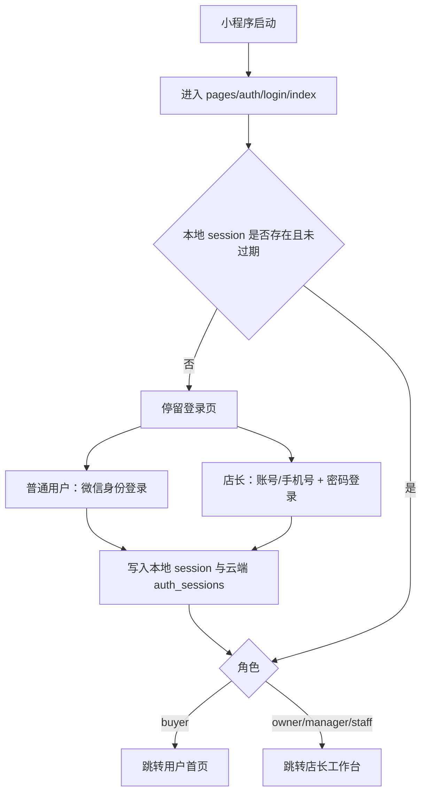

# 初炉小程序首次启动与登录流程排查报告

## 当前结论

小程序首屏应设置为登录页。当前已将 `pages.json` 的第一个页面调整为：

```json
{ "path": "pages/auth/login/index", "style": { "navigationStyle": "custom" } }
```

微信小程序会默认打开 `pages` 数组第一项，因此未登录用户首次打开会先进入登录页。

## 启动流程



## 未登录访问非登录页的风险

- 订单、地址、下单页面可能缺少用户身份，导致数据查询为空、误展示演示数据或提交失败。
- 店长后台若只靠前端入口隐藏，存在被直接打开路径的风险。
- 下单、取消订单等操作如果没有 session 约束，异常场景下会出现业务状态不完整。
- 首屏先展示首页再跳登录，会造成用户看到未授权内容闪现，体验不稳定。

## 技术实现

- `pages.json` 首项改为登录页。
- `utils/auth.js` 将登录页以外的页面统一视为需要登录。
- 店长后台路径 `/pages/admin/*` 额外要求角色为 `owner`、`manager` 或 `staff`。
- 本地 session 存储在 `app_auth_session`，过期时自动清理。
- 登录页 `onShow` 检查已登录状态，已登录用户直接进入对应首页。
- 云函数侧继续校验 token，前端拦截不是唯一安全边界。

## 验收场景

| 场景 | 期望 |
| --- | --- |
| 首次启动，无 session | 进入登录页 |
| 已登录普通用户重新启动 | 自动进入用户首页 |
| 已登录店长重新启动 | 自动进入店长工作台 |
| session 过期后重新启动 | 清理登录态并停留登录页 |
| 未登录直接打开后台页 | 跳转店长登录 |
